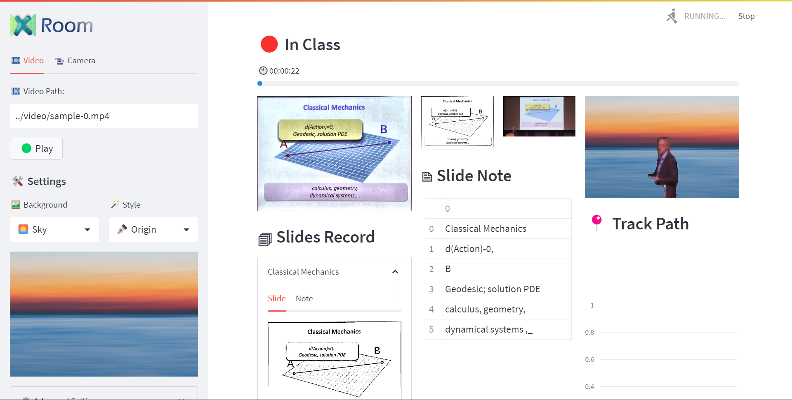

# X-Room


This is the coursework for course **`COMP3065 Computer Vision (2023)`** of the University of Nottingham Ningbo China.
An application named **`XRoom`** is designed for this coursework.
- Author: Jiarui LI (20216422)
- E-mail: scyjl6@nottingham.edu.cn
This software is going to adapt computer vision technique to implement a virtual classroom, which contains the functions:
1. Segment lecturer in the classroom and display.
2. Change the background of the lecturer.
3. Focus the camera on and track people who are speaking.
4. Strengthen the display of the board.
5. Provide notes for the slides.



How to run the application
```bash
cd xroom
streamlit run xroom.py --server.port 80
```

## Videos

### Demo
[demo.mp4](./demo.mp4)
<video src="demo.mp4"></video>

### Sample Videos
1. [./video/sample-0.mp4](./video/sample-0.mp4)
   <video src="./video/sample-0.mp4"></video>
2. [./video/sample-1.mp4](./video/sample-1.mp4)
   <video src="./video/sample-1.mp4"></video>
3. [./video/sample-2.mp4](./video/sample-2.mp4)
   <video src="./video/sample-2.mp4"></video>


## Environment
diffusers                0.12.1
easyocr                  1.6.2
imageio                  2.28.1
invisible-watermark      0.1.5
matplotlib               3.7.0
numpy                    1.24.2
opencv-python            4.5.5.64
pandas                   1.5.3
Pillow                   9.4.0
plotly                   5.14.1
scikit-image             0.20.0
scikit-learn             1.2.1
scipy                    1.9.1
seaborn                  0.12.2
streamlit                1.22.0
torch                    2.0.0
torchvision              0.15.1
tqdm                     4.65.0